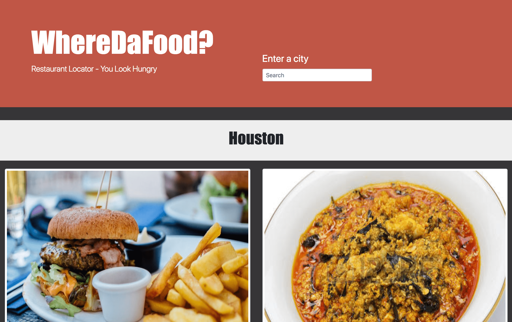
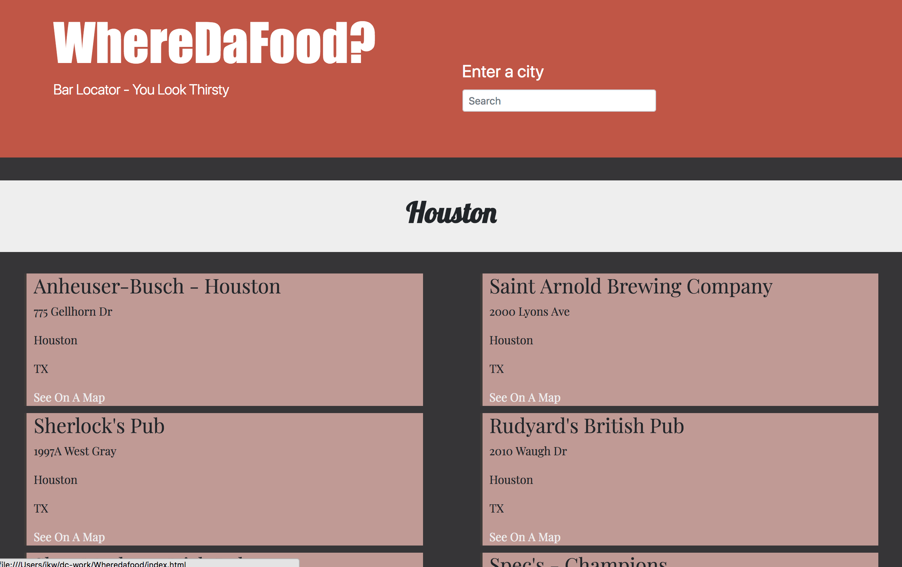

# WhereDaFood?

A gastronomic site that helps you to find food and drink near whatever area you're in. It will ask you what and where you're
looking for and give you some results on a map.

WhereDaFood? Restaurant Page

WhereDaFood? Bars Page

## Built With

* HTML5
* [BOOTSTRAP 4](https://getbootstrap.com/) - CSS framework
* [JQUERY](https://jquery.com/) - Javascript framework
* AJAX - API parsing

## Authors

* **Connor Schuster** - *Initial work* - [SChuster1995](https://github.com/CShuster1995)
* **Nate Izuora** - *Initial work* - [Nathan Izuora](https://github.com/NathanIzuora)
* **Jesse Kent Weaver** - *Initial work* - [H0bbyist](https://github.com/H0bbyist)

#Proccess (shortened)

* **First** We created the food searching function using google maps api.
* **Second** We built a page to display the food types and prompt the user for their location.
* **Third** We created a bar finding app using a newer api caller beermapper. It wasn't as straight forward to use as googles api so it took some work to get it running properly.
* **Fourth** We build the beer page, much like the food page, which would list the top bars in an area and offer you a map to that location.
* **Finally** We created a home page in which you could choose; Are you hungry? Or are you thirsty?

## Acknowledgments

* Thanks to all the teachers at DigitalCrafts
* Thank you to everyone on the team for the sleepless nights finding those typos. 
* Thank you to our new friends and collegues here at digital crafts for providing support without hesitation. 

